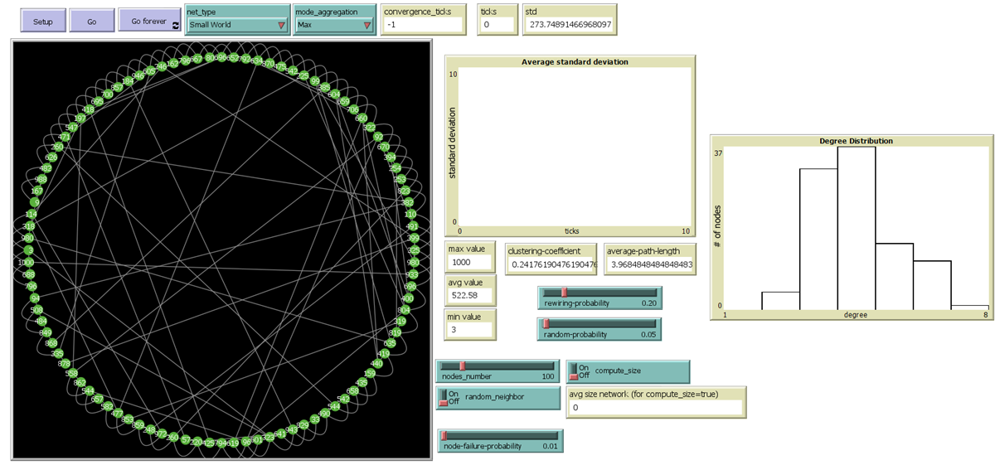

# Distributed Aggregation on Various Network Structures
Behavioral and performance analysis of distributed aggregation algorithms on various types of networks: Lattice, Random, Small World and Scale-free.
Language and tool used: NetLogo. See the PPTX for more information and details.

